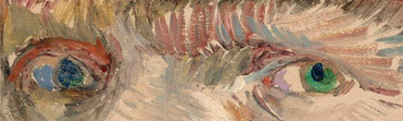

## 你好，我叫江若兰。Noitia, eu sou a Jhordanna! 🌞 
### 🧬 Bioinformática | Saúde Digital 🌞  | Engenharia de Software✨

<!--
**ceulazur/ceulazur** is a ✨ _special_ ✨ repository because its `README.md` (this file) appears on your GitHub profile.

-->
 

  <a href="https://github.com/ceulazur">
          <td> </td>

  </a>

 

  <!-- Work Links -->
    <!-- git hub-->
  
 <!-- git lab
   -->
   <!-- linkedin-->
  
   <!-- gmail-->
  
  <!-- twitch -->
  
   <!-- youtube -->
  
   
  <!-- Social Links -->
  
  
  <!-- OTH Links -->
  

## 🌞 Sobre mim

Sou graduanda do sexto semestre de <b>Engenharia de Software</b> pela Universidade Federal do Ceará (UFC) e, atualmente, busco me aprofundar em Data Science e Cybersecurity. Meu foco nos últimos dois anos tem sido saúde digital e bioinformática, meus grandes amores. Sou muito curiosa e persistente, então, além de fazer um pouco de tudo, estou sempre buscando melhorar a cada nova tentativa. Por aqui, gosto de compartilhar meus projetos pessoais (majoritariamente em Python), meus trabalhos da faculdade e derivados. Atualmente, estou estudando R e provavelmente trarei repositórios sobre isso.

## 🌸Objetivos
- Meu objetivo principal é utilizar a tecnologia para ampliar o acesso à saúde de qualidade, garantindo que o máximo de pessoas, independentemente de sua localização ou condição socioeconômica, possa receber atendimento adequado.
- Também tenho como meta colaborar no desenvolvimento de pesquisas avançadas em genética, no intuito de promover cada vez mais inovações na área da saúde humana.

  <table>
    <tr>
      <td><b>🎓 Engenheira de Software</b></td>
      <td><b>🧪 Bioinformata</b></td>
    </tr>
    <tr>
      <td></td>
      <td> </td>
    </tr>
  </table>

## Além da engenharia de software...

- Amo apreciar e fazer arte;
<td> </td>

-  Adoro jogar Stardew Valley;
<td> </td>

- Costumo pintar e escrever poesias que às vezes posto no [Youtube](https://www.youtube.com/c/C%C3%A9ulazur/videos) e no [Instagram](https://instagram.com/ceulazur).
<td> </td>

- Amo assistir filmes, series e animes. Logo, deixo minhas recomendações no meu [Letterboxd](https://letterboxd.com/ceulazur/)
 <td> </td>

- Também gosto muito ler e às vezes recomendo alguns livros nas minhas redes sociais. 
Vou até deixar algumas recomendações aqui: 
  - Os miseráveis - Victor Hugo
  - Agassi - Andre Agassi
  - Filha das Trevas - Kiersten White
  - Americanah - Chimamanda Ngozi Adichie
  - Angústia - Graciliano Ramos
   

  <table>
    <tr>
    <td> </td>
    <td> </td>

  </table>

## 🦕🌞 Soft Skills
- Comunicação;
- Liderança;
- Empatia;
- Flexibilidade;
- Inteligência emocional;
- Pensamento crítico;
- Criatividade;
- Responsabilidade.

## ⭐️ Hard Skills

                            <!---->     <!----><!-- -->     <!-- -->  <!---->  <!--[Gimp](https://img.shields.io/badge/Gimp-657D8B?style=for-the-badge&logo=gimp&logoColor=FFFFFF) --> <!--  -->      <!--  --><!--   -->  <!-- --> 

# 📊 GitHub Stats:
 
 

## 🏆 GitHub Trophies

<!--### 🔝 Top Contributed Repo

---
 -->

<td> </td>
<td> </td>
 <td></td>